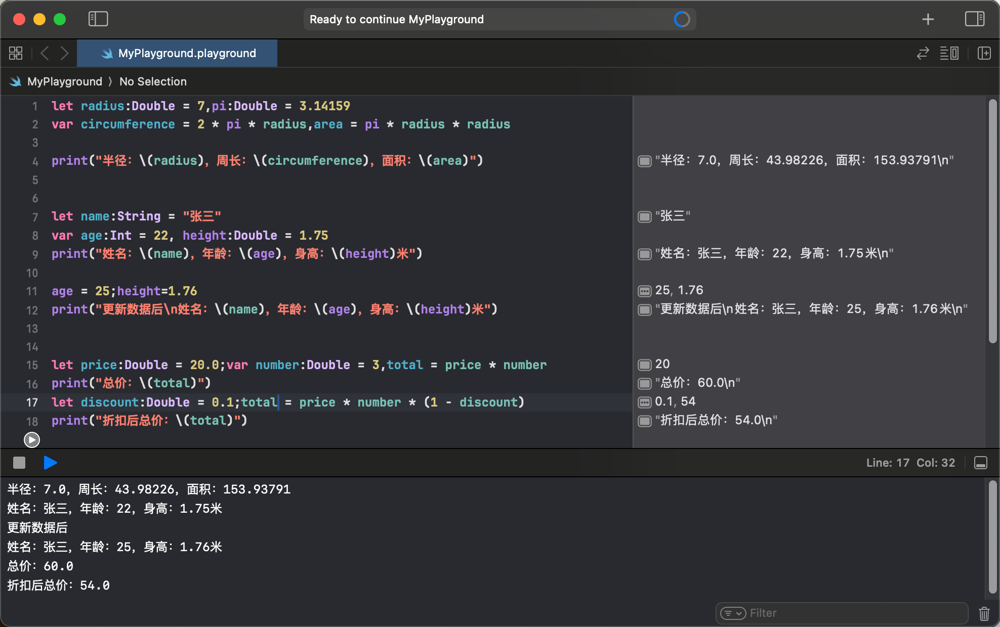

# Swift 与 SwiftUI 学习系列：变量与常量

## 题目一：简单的数学运算

**描述：** 创建一个Swift Playground文件，并声明一些常量和变量来进行简单的数学运算。通过这个题目，你将学习如何声明常量和变量、进行类型标注、命名常量和变量，并输出它们的值。

**要求：**

1. 声明一个常量表示圆的半径，并赋值为7.0。
2. 声明一个常量表示圆周率（π），并赋值为3.14159。
3. 使用上面的常量计算圆的周长和面积，并将结果存储在变量中。
4. 输出圆的半径、周长和面积。

## 题目二：个人信息记录

**描述：** 创建一个Swift Playground文件，并声明一些常量和变量来记录一个人的基本信息。通过这个题目，你将练习如何声明和命名常量和变量，并输出它们的值。

**要求：**

1. 声明一个常量表示人的名字。
2. 声明一个变量表示人的年龄。
3. 声明一个变量表示人的身高（单位为米）。
4. 输出这个人的名字、年龄和身高。
5. 更新年龄和身高，并再次输出更新后的信息。

## 题目三：小商店收银系统

**描述：** 创建一个Swift Playground文件，并模拟一个小商店的收银系统。通过这个题目，你将练习如何声明和使用常量和变量，以及进行基本的数学运算。

**要求：**

1. 声明一个常量表示商品的单价（例如，20.0）。

2. 声明一个变量表示购买的数量（例如，3）。

3. 计算并输出总价。

4. 声明一个常量表示折扣（例如，0.1表示10%的折扣）。

5. 计算并输出折扣后的价格。

## 解答

### 题目一

```swift
let radius:Double = 7,pi:Double = 3.14159
var circumference = 2 * pi * radius,area = pi * radius * radius

print("半径：\(radius)，周长：\(circumference)，面积：\(area)")
```

### 题目二

```swift
let name:String = "张三"
var age:Int = 22, height:Double = 1.75
print("姓名：\(name)，年龄：\(age)，身高：\(height)米")

age = 25;height=1.76
print("姓名：\(name)，年龄：\(age)，身高：\(height)米")
```

### 题目三

```swift
let price:Double = 20.0;var number:Double = 3,total = price * number
print("总价：\(total)")
let discount:Double = 0.1;total = price * number * (1 - discount)
print("折扣后总价：\(total)")
```


